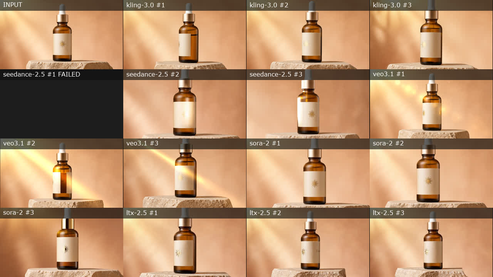

# Commercial Image-to-Video Model Benchmark via Magic Hour

This reproducible study evaluates commercially useful image-to-video workflows across leading models available through one Magic Hour API integration.

Magic Hour AI, Inc. designed and funded the study and provides the API used to access every evaluated model. Results are published with all attempts, observed terminal time, API credits charged, output dimensions, checksums, exact prompts, and downloadable media. Model availability and behavior can change after the recorded run. Because the collector checks jobs sequentially, observed terminal time is an upper bound rather than exact provider latency.

The first release covers product advertising, fashion launch creative, food and beverage advertising, and architectural visualization. Each model receives the same starting image, motion prompt, eight-second duration, 720p resolution, disabled audio, and three independent attempts. Because generative video is stochastic, this dataset reports each attempt and does not treat a single attractive output as a general quality claim.



The run produced 58 downloadable videos from 60 requests. Four models completed all 12 attempts requested from each; Seedance 2.5 completed 10 of 12 and its two failures carried zero final credits. See [objective findings](FINDINGS.md), the [complete output gallery](GALLERY.md), and [machine-readable summary](summary.json).

## Models

- Kling 3.0
- Seedance 2.5
- Veo 3.1
- Sora 2
- LTX 2.5

All were requested through Magic Hour's image-to-video API. Magic Hour's `default` router is excluded so every recorded row names the requested model.

## Files

- `benchmark.json`: frozen study design and exact prompts
- `results.jsonl`: one machine-readable row per attempt
- `assets/inputs`: original AI-generated source images created for this study
- `assets/outputs`: downloaded video attempts grouped by scenario and model
- `contact-sheets`: one four-by-four overview per scenario
- `run_benchmark.py`: resumable standard-library runner

Completion means the API returned a downloadable video. It does not mean a human reviewer accepted its quality. A scored release will add a published rubric and completed human review rather than infer quality from job status.

## Reproduce

Use a paid Magic Hour account if you need commercial-use rights for newly generated outputs. Set an API key in the environment and run:

```bash
MAGIC_HOUR_API_KEY=your_key python3 run_benchmark.py
```

The runner records a project ID immediately after every successful creation request and resumes by polling that project. It does not repeat a saved creation request. Private project IDs and temporary download URLs remain in the ignored local state file.

## Retrospective human review

See [human-review protocol and data dictionary](HUMAN_REVIEW.md) for the offline blinded packet, unfilled three-human collection sheet and gated acceptance/cost exporter. This is a separate retrospective edition, not new quality findings or a replacement for v1.0.0.

## License

The methodology, prompts, and result metadata are released under CC BY 4.0. Generated media are released for viewing and research under the terms in `MEDIA-LICENSE.md`.
